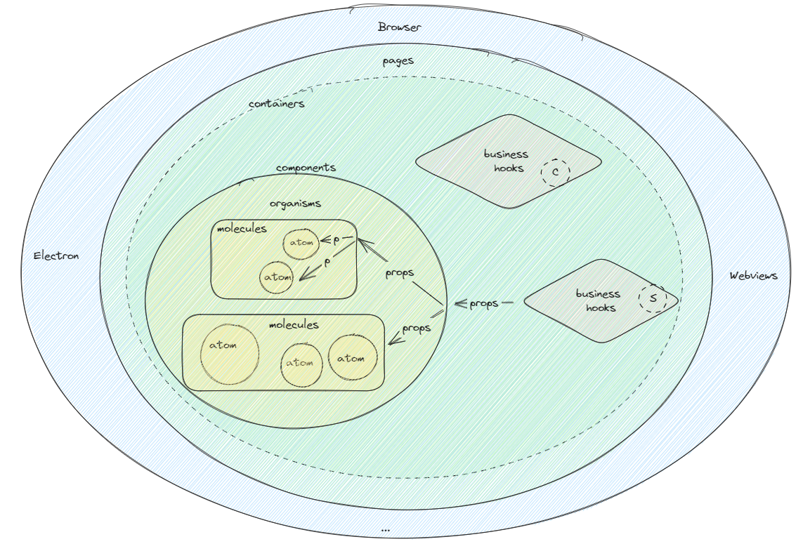

# react-template-next

## Quick to build a modern react app with react clean architecture！

### Features ✨

- 🏗️ bootstrap by [vite](https://vitejs.dev/)
- ⚛️ framework by [react](https://beta.reactjs.org/)
- 🧬 language by [typescript](https://www.typescriptlang.org/)
- 🏭 build by tsc & [vite](https://github.com/vitejs/vite)
- 🖼️ component by [mui](https://mui.com/)
- ⚛️ design-pattern by [atomic design](https://atomicdesign.bradfrost.com/)
- 📔 ui component explorer by [storybook](https://storybook.js.org/)
- 🎛️ state-management by [zustand](https://zustand-demo.pmnd.rs/)
- 📝 form by [react-hook-form](https://react-hook-form.com/) & form-validation by [zod](https://zod.dev/)
- ⚓ page-router by [react-router](https://reactrouter.com/)
- 💥 error-boundary by [react-error-boundary](https://github.com/bvaughn/react-error-boundary)
- 🪝 react-hooks by [ahooks](https://ahooks.js.org/)
- 📡 http-client by [use-request](https://ahooks.js.org/hooks/use-request/index) & [axios](https://axios-http.com/)
- 🪄 makes typescript's built-in typings be better by [ts-reset](https://github.com/total-typescript/ts-reset)
- 🎏 create immutable-state by [immer](https://immerjs.github.io/immer/)
- 📅 date-tools by [dayjs](https://day.js.org/)
- 🏘️ test-framework by [vitest](https://vitest.dev/)
- 🐙 unit-test by [@testing-library](https://testing-library.com/)
- 🎭 e2e-test by [cypress](https://www.cypress.io/)
- 👀 lint-code by [eslint](https://eslint.org) & [prettier](https://prettier.io/)
- 🔍 dependencies checker by [madge](https://github.com/pahen/madge)
- 📊 test-coverage by [c8](https://github.com/bcoe/c8)
- 🚀 performance monitoring by [react-scan](https://react-scan.com/)
- 🕵️ commit-check by [husky](https://typicode.github.io/husky/#/) & [lint-staged](https://github.com/okonet/lint-staged)
- 🧩 other tools:[json-server](https://github.com/typicode/json-server) [radash](https://github.com/toss/radash/tree/main) & [promise-pool](https://www.npmjs.com/package/@supercharge/promise-pool)

### About Env 🌌

- Node version need >=18
- If you want to run the "output-dependencies" script, you must have [graphviz](<(https://graphviz.gitlab.io/download/)>) installed.

### Other version 🔗

- [css by tailwind](https://github.com/zpm683/react-template-next/tree/tailwindcss)

### How to use? 🤨

Step1：clone this project  
 Step2：npm i  
 Step3：npm run dev  
 Step4：make your components in src/\*\*  
 Step5: make your test code in test/\*\*  
 Step6: run scripts (build/preview/test/lint/...)

that's all, happy hacking!

### Script 🪃

- dev
- mock
- build
- preview
- test
- e2e-test
- lint
- coverage
- storybook
- build-storybook
- check-circular
- output-dependencies
- remove-node_modules
- upgrade-node_modules

### Catalog 📑

```txt
├─.husky
├─.mock
    ├─config.json
    └─data.json
├─.storybook
├─.vscode
├─coverage
├─dist
├─node_modules
├─public
├─storybook-static
├─.env.development
├─.env.production
├─.gitignore
├─.madgerc
├─.prettierignore
├─.prettierrc
├─architecture.png
├─dependencies.svg
├─.eslint.config.js
├─index.html
├─LICENSE
├─package.json
├─README.md
├─stats.html
├─tsconfig.json
├─vite.config.ts
└─src
    ├─app
    | ├─@types
    | ├─apis
    | ├─components
    | | ├─atoms
    | | ├─molecules
    | | ├─organisms
    | | └─index.ts
    | ├─constants
    | ├─hooks
    | ├─layouts
    | ├─features
    | ├─stores
    | ├─themes
    | ├─utils
    | ├─app.tsx
    | └─index.ts
    ├─shared
    | ├─components
    | ├─hooks
    | └─utils
    ├─test
    | └─setup.ts
    ├─index.css
    ├─index.tsx
    ├─reset.d.ts
    └─env.d.ts
```

### About React-Clean-Architecture 🧐



### Demo ⚛️

- [react-todo-demo](https://github.com/zpm683/react-todo-demo)
